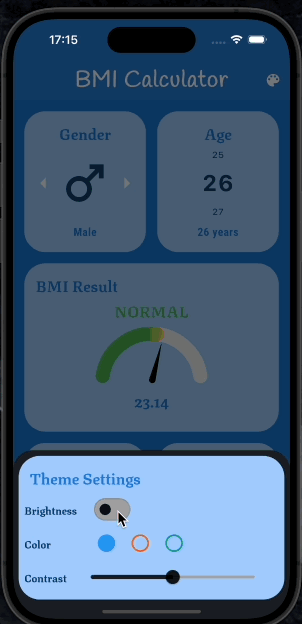

# BMI Calculator
Simple BMI Calculator app developed as a part of App-brewery course

---
## Features

- BMI result is updated instantaneously when either Weight or Height are updated. Thus,no need to press any button
- app bar action to trigger Widget for theme settings
- Theme settings widget to dynamically change
  - brightness
  - theme color, from set of 3 colors for demo
  - contrast
- Singleton class for BMICalculator and, AppTheme
- Wheel slider for selection of input
- used ValueLNotify and ValueListenableBuilder so that , Result Widget is built only when there is a change in bmi.value
  - using ValueLNotify and ValueListenableBuilder help us manage state in much better and maintainable way
- Single BuildDisplay() class used to display all widget, making it much more easy to manage and theme across app
- Single stateful InputWidget, so we can manage input states in one single place and,same InputWidget class is used to compose specific inputs
- Output shows gauge which has range of color gradiant from green,yellow to red based on the BMI result

---
### External dependencies
- [google-fonts](https://pub.dev/packages/google_fonts): used for exprimenting with fonts in development phase
- [Wheel Slider](https://pub.dev/packages/wheel_slider): used for selectable wheel slider as input for all values
- [Gauge indicator](https://pub.dev/packages/gauge_indicator): used for making result more appealing with meter like gauge

---
## Todo
- replace google-fonts with downloaded static fonts
- add more units to the input such as
  - weight: in pounds  and stones
  - height: in meters and, feet' inch
- convert theme settings to ValueNotifier for easy state management
- account for gender and age in BMI calculation instead of using simple  formula

Demo
----
